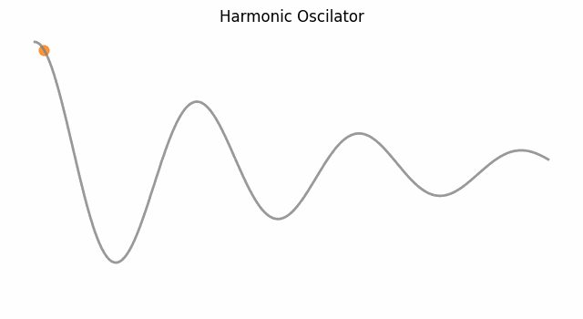
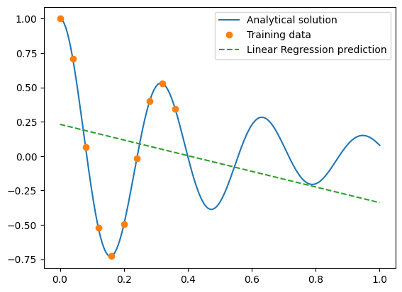
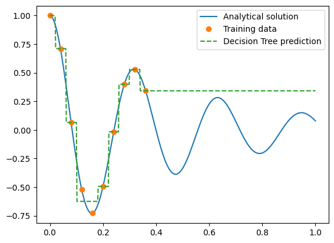
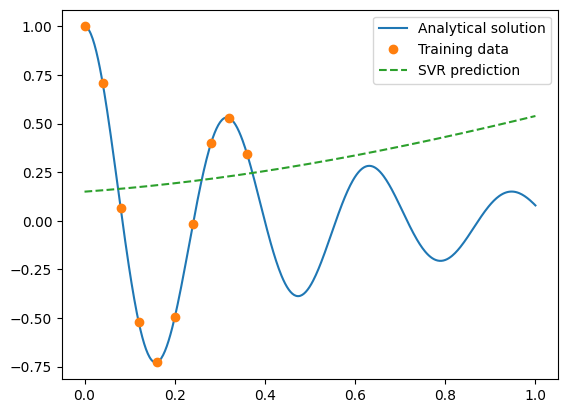
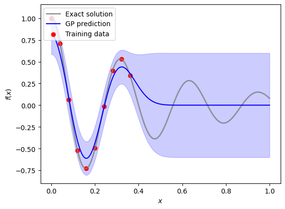
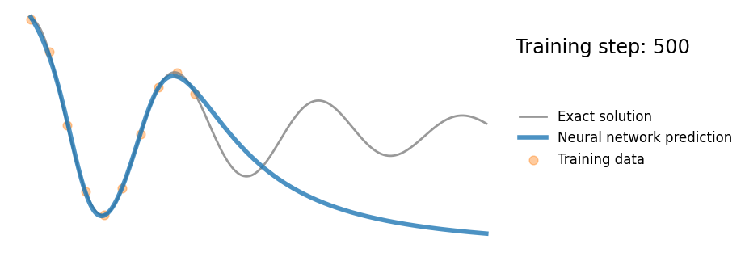
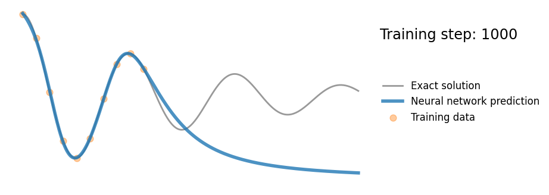
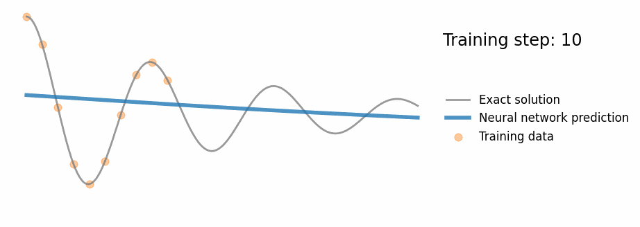

# Title: Predicting Damped Harmonic Oscillator using Machine Learning and Neural Networks

# Abstract
In this project, we investigate the use of various machine learning techniques, including traditional models and neural networks, for the task of predicting the behavior of a damped harmonic oscillator. The results show that these methods struggle with extrapolating the sinusoidal behavior outside the range of the training data.

# Introduction
Damped harmonic oscillators are a fundamental concept in physics, describing a wide range of phenomena including the motion of a pendulum subject to friction, the behavior of a RLC circuit, and more. In an ideal scenario, the behavior of such systems can be described analytically with well-established differential equations. However, when we attempt to model these systems using machine learning, we encounter some intriguing challenges. Below is the animated GIF of the oscillator:

# Methods
In this study, we use a simple harmonic oscillator system with known damping and frequency parameters. We generate synthetic data based on the known oscillator equations and use this data as our ground truth. We then attempt to predict the oscillator's behavior using various machine learning techniques.

The machine learning techniques used in this study include:

1. Linear Regression
2. Support Vector Regression (SVR)
3. Decision Tree Regression
4. Neural Networks
5. Gaussian Process
We train these models on a small subset of the oscillator data and test their performance on the entire data set, including areas outside the range of the training data. This allows us to assess the ability of each model to extrapolate beyond the training data.

# Results
The results of our study show that traditional machine learning methods, such as linear regression, SVR, and decision trees, are unable to accurately capture the sinusoidal behavior of the harmonic oscillator.

Neural networks performed somewhat better, successfully capturing the sinusoidal pattern within the training data range. However, they still struggled with extrapolating the sinusoidal behavior beyond the range of the training data. Here are the comparison plots for each of the machine learning models.

<table>
    <tr>
        <td rowspan="2">  </td>
        <td rowspan="2">  </td>
        <td rowspan="2">  </td>
        <td rowspan="2">  </td>
        <td>  </td>
    </tr>
    <tr>
        <td>  </td>
    </tr>
</table>

Below is the animated GIF showing the Neural Network model:

# Discussion
The results of this study demonstrate the challenges of using machine learning techniques for physical systems modeling, especially when extrapolation is required. While machine learning models can be very good at interpolation (predicting within the range of the training data), they generally struggle with extrapolation (predicting outside the range of the training data).

One possible solution could involve hybrid models that combine physics-based modeling with machine learning. These models could leverage the strengths of both techniques: the ability of physics-based models to extrapolate based on physical laws, and the ability of machine learning to correct inaccuracies in the physics-based models based on observed data.

# Conclusion
In this study, we have explored the use of machine learning for predicting the behavior of a damped harmonic oscillator. We found that while these methods have shown promise in many areas, they face significant challenges in tasks that require accurate extrapolation. Future work in this area may involve the development and testing of hybrid models that combine the strengths of physics-based and machine learning models.
